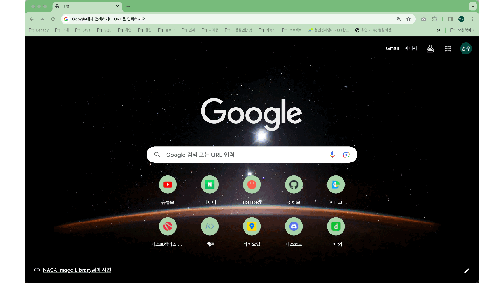
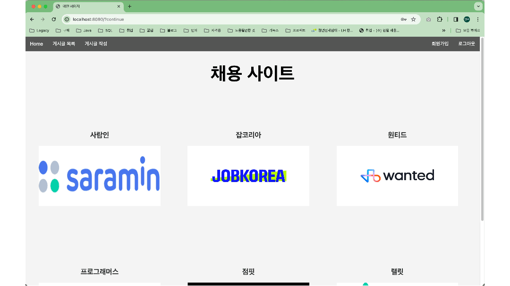
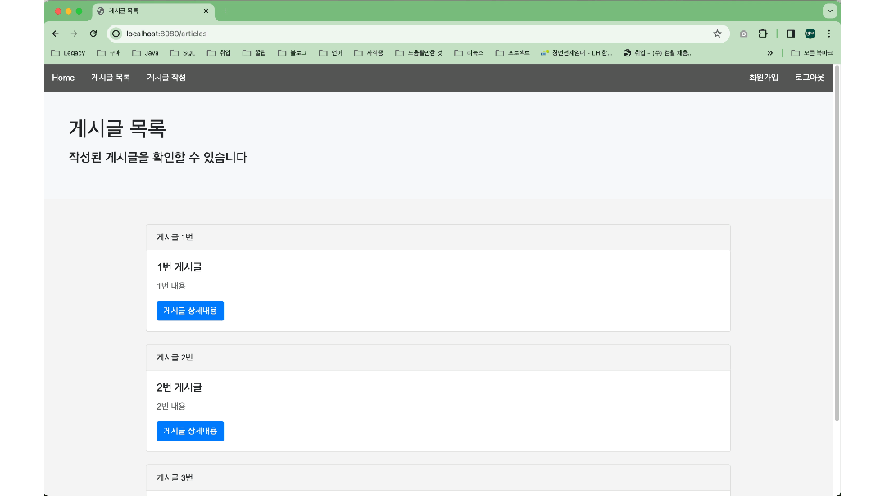

# Web-Porject
스프링 시큐리티를 이용한 로그인 기능과 게시판 기능이 있는 웹 프로젝트

 

# 1. 개요
프로젝트 명: Web-Project  
개발 인원: 1명  
기간: 2023.12.24 ~ 2023.12.27  
주요 기능: 스프링 시큐리티를 이용한 로그인/로그아웃 회원가입 기능, 게시판 글 CRUD 기능  
기술: Java, SpringBoot, JavaScript, Lombok, REST API, SQL, HTML, Bootstrap, Thymeleaf  
DB: H2 Database  
Packaging: Jar

 

# 2. 개발도구
개발 언어: JAVA  
프레임 워크: Spring Boot  
통합 개발 환경(IDE): IntelliJ(Community version)  
View template: Thymeleaf  

 

# 3. 기능 구현
### 회원가입 및 로그인 기능  
`http://localhost:8080`를 입력했을 때 로그인 창으로 이동 후 회원가입 진행
회원가입한 대로 이메일 비밀번호 입력

 

### 게시글 작성  
로그인 상태
header에 Home(/) -> 게시글 작성(/new-article) -> 게시글 목록(/articles) redirect

 

### 게시글 수정 및 삭제  
글 수정/삭제 -> -> 게시글 목록(/articles) redirect

 

### 전체 기능 시현  

 

# 4. 블로그 기록
[프로젝트 생성 및 기본 index 페이지](https://build-enough.tistory.com/367)  

 

[thymeleaf를 사용하여 레이아웃 적용](https://build-enough.tistory.com/368)

 

[게시판 리스트 페이지 생성](https://build-enough.tistory.com/369)

 

[스프링 시큐리티를 사용한 인증, 인가](https://build-enough.tistory.com/370)

 

[게시판 기능(CRUD)](https://build-enough.tistory.com/371)

 

[글 작성 view 구현](https://build-enough.tistory.com/372)

